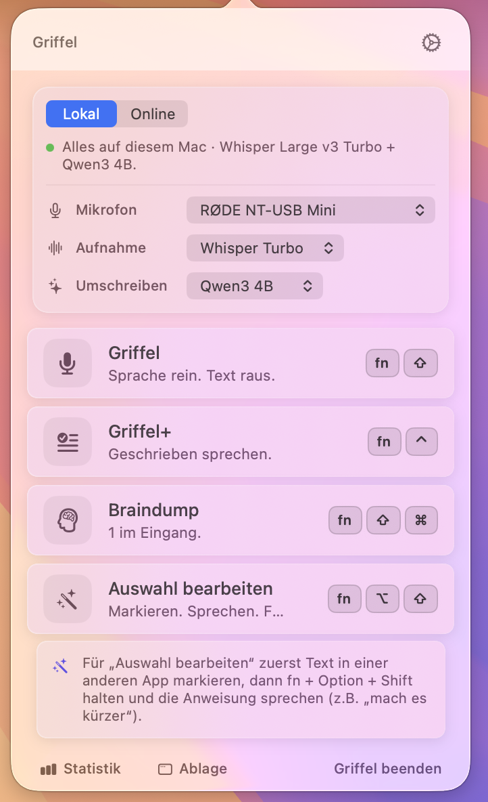
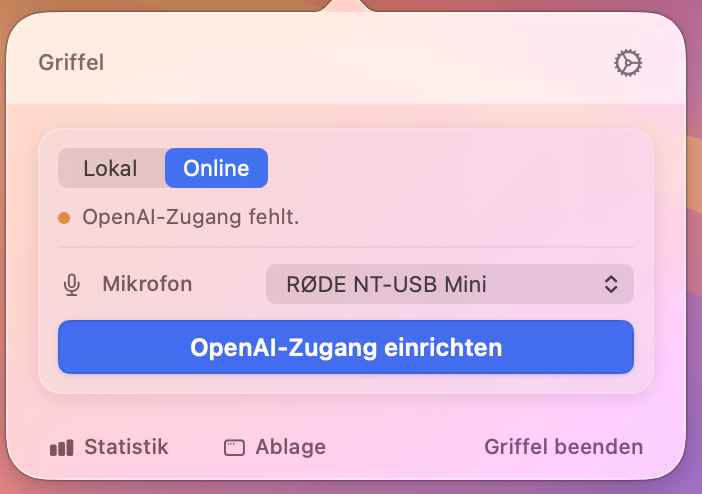
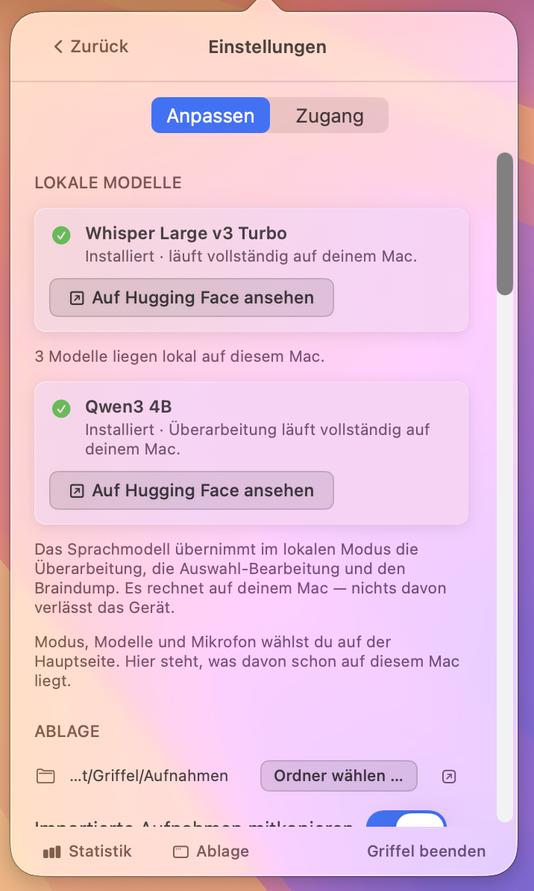
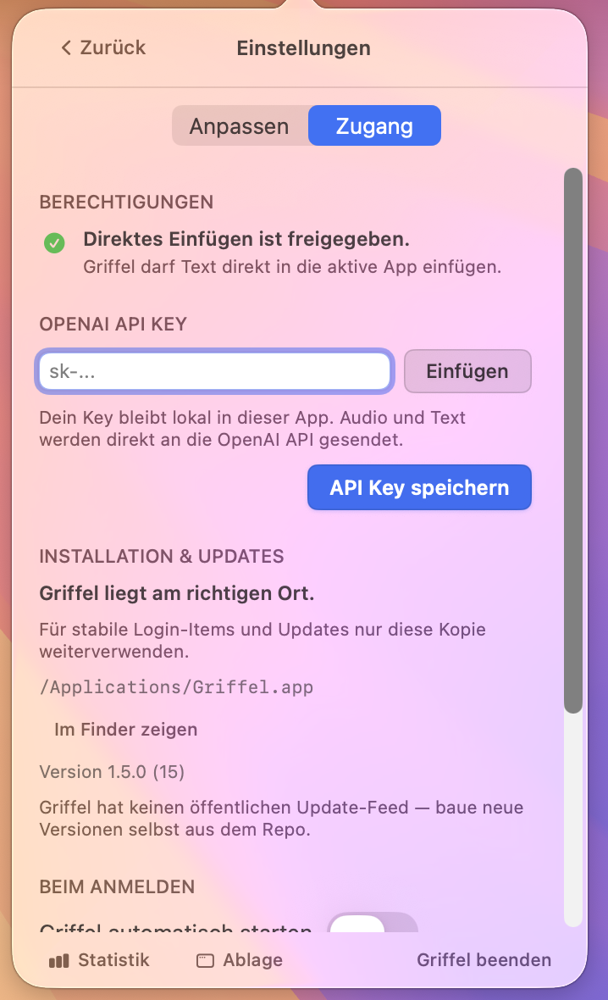
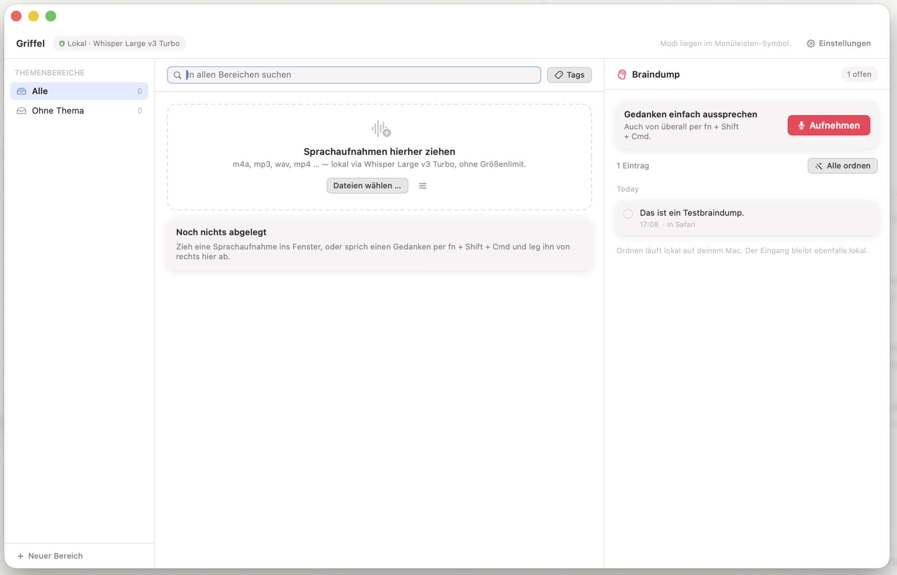

# Griffel

Griffel is an experimental open-source macOS menubar app for turning speech into text.

It is intentionally small and unfinished. The goal is to make a real workflow visible and hackable: press a hotkey, speak, get text back, optionally rewrite it, and paste it into the app you were using.

This is a learning and experimentation project, not a polished product.

> Preview status: bring your own OpenAI API key, no hosted backend, no warranty, no support guarantee.
>
> Griffel is derived from **Blitztext** (MIT). The app, bundle identifier, and data folders migrate forward automatically from a Blitztext installation (see [Upgrading from Blitztext](#upgrading-from-blitztext)).

## What It Does

- **Griffel**: record speech and transcribe it.
- **Griffel+**: record speech, transcribe it, then rework the rough draft. Two levels, picked in the settings — *Korrektur* fixes spelling, grammar and fillers while leaving your wording alone, *Lektorat* rephrases and smooths the writing using your Schreibstil and Kontext.
- **Braindump**: capture a spoken thought into a local inbox instead of pasting it — **Ordnen** turns the collected entries into a summary, tasks, and ideas (via OpenAI, or the on-device model in Sicherer Lokaler Modus), and filing that result into the Ablage is what clears the entries out of the inbox.
- **Auswahl bearbeiten**: select text in any app, speak an instruction ("mach es kürzer", "übersetze ins Englische"), and the selection is replaced with the edited result (via OpenAI, or the on-device model in Sicherer Lokaler Modus; needs Accessibility).

Rewriting runs against OpenAI by default. In **Sicherer Lokaler Modus** the app never contacts OpenAI — transcription runs on-device via WhisperKit and all rewriting runs on-device through MLX with a Qwen3 model you download once from the main page.

Around the workflows:

- **App window with Ablage and settings**: open the app's window from the popover footer (**Ablage**), from the Dock icon, or with **⌘,**. It has two halves, switched from the header:
  - **Ablage** — three columns side by side: your topic folders, the recordings filed in them, and the Braindump inbox.
  - **Drag and drop**: drop voice recordings anywhere on the window (m4a, mp3, wav, mp4 and friends) — or straight onto a topic folder. They are transcribed by the same engine a spoken run uses (WhisperKit on device in Sicherer Lokaler Modus, `whisper-1` at OpenAI otherwise) with the same language, glossary and filler settings. An optional *Nachbearbeiten* switch runs Griffel+ over the result. Your original file is never moved or modified.
  - **Storage location**: pick where recordings and transcripts live (Einstellungen › Ablage). Every transcript is a plain `.md` file next to its audio, so the folder stays readable, greppable and Spotlight-indexable without Griffel. Topic folders are real folders on disk.
  - **Tags and search**: tag any recording, filter by tag, and search titles, transcripts and tags — scoped to the selected topic, with one click to widen it to everything.
  - A Braindump entry can be filed into a topic folder from the same window. Closing the window returns the app to the menu bar.
  - **Einstellungen** — the same settings the popover has, laid out for a window: the two sections in a sidebar beside the content rather than stacked above it, in a column wide enough that rows stop truncating. ⌘, opens the window straight here. The modes stay in the menu bar icon, because every one of them but Braindump ends by pasting into the app you were in — and with this window in front, that app is Griffel.
- **Hotkey HUD**: a small floating glass panel with a live waveform shows recording and processing status when a workflow is started via hotkey, and names the microphone it is actually listening on.
- **Live-Transkript**: while recording with local WhisperKit, a rolling partial transcript previews in the hotkey HUD and popover as you speak. It is cosmetic only — the final text always comes from the batch pass over the finished recording, so a missed or rough partial never affects output. Local-only (needs the on-device WhisperKit backend) and off by default.
- **Auto-stop on silence**: optionally end a recording automatically after a configurable pause once you have started speaking (works with any transcription backend). Off by default; Braindump is intentionally excluded so long-form "pause to think" capture keeps running.
- **Wörterbuch (glossary)**: your own terms with optional definitions bias transcription and rewriting; a Denglish language mode preserves English terms embedded in German speech.
- **Füllwörter entfernen**: optional filler-word removal ("ähm", "hm", ...) for plain transcriptions.
- **App-Profile**: optional per-app output formatting (Terminal, E-Mail, Chat, Code) based on which app the text will be pasted into.
- **Microphone selection**: pick a specific input device instead of the system default. While recording, the HUD and the popover name the input actually in use — not the one in the settings. If the device you picked has been unplugged, recording falls back to the system default and the label says `· Standardgerät`, so the fallback is visible rather than silent.
- **Braindump-Kontext**: a spoken Braindump can note which app — and optionally which window — you were in when you said it, so „nicht vergessen: Rechnung" still makes sense next week. Local-only, never sent to a language model, and a three-way switch in the settings (*Aus* / *Nur App* / *App und Fenstertitel*) because window titles can carry document names, subjects and URLs.
- **Statistik**: local-only usage statistics (words, sessions, estimated time saved) — never sent anywhere.
- **Häufige Phrasen**: local-only counts of recurring 2–4-word phrases from your dictations feed the Statistik page, glossary suggestions, and result highlighting. Only aggregated counts are stored, never full texts; the feature can be disabled and its data deleted in the app.

## Important Preview Notes

- macOS only.
- The app's user interface is German; the documentation is English.
- Bring your own OpenAI API key.
- No hosted backend is included or provided.
- In online mode, audio and text are sent directly from the app to the OpenAI API.
- Optional fully local operation: WhisperKit/CoreML for transcription and a Qwen3 MLX model for rewriting, both installed from within the app.
- Imported recordings and their transcripts are stored on disk in a folder you choose. Transcribing one sends it to OpenAI unless Sicherer Lokaler Modus is on — see [Data Flow](#data-flow).
- `./build.sh` creates a locally ad-hoc-signed development app. No notarized release binary is provided.
- Not production ready.
- No warranty and no support guarantee.

You are welcome to use, fork, adapt, and share this project under the license terms.

The intent is not to ship a one-click finished app. The intent is to make a real AI workflow understandable: clone it, build it, read the code, change it, break it, fix it, and suggest improvements. If you only want to download something and never look inside, this preview will probably feel rough. If you want to learn how a small native macOS AI app is put together, you are in the right place.

## Screenshots

<table>
  <tr>
    <td></td>
    <td></td>
  </tr>
  <tr>
    <td></td>
    <td></td>
  </tr>
</table>



The main page carries the one decision — where dictation is processed — as a Lokal/Online control on a single card, together with the microphone and both local models; modes the current setup cannot run are hidden rather than greyed out. The window shows the Ablage's three columns: topic folders, filed recordings, and the Braindump inbox.

## Requirements

- macOS 14 or newer on **Apple Silicon** — MLX computes through Metal against unified memory and has no x86_64 backend, so the app is no longer a universal build
- Full Xcode 26 or newer, selected via `xcode-select` — the Command Line Tools alone are not enough
- The Metal toolchain component, which MLX needs to compile its shaders. Xcode 26 no longer ships it; `build.sh` checks for it and tells you the command:
  ```bash
  xcodebuild -downloadComponent MetalToolchain
  ```
- [XcodeGen](https://github.com/yonaskolb/XcodeGen) to generate the Xcode project
- For online transcription and rewriting: an OpenAI API key with access to:
  - `whisper-1` for transcription
  - `gpt-4o-mini` and `gpt-4o` for rewriting, selection editing, and braindump processing
- For local-only transcription: a WhisperKit CoreML model in:
  `~/Library/Application Support/Griffel/models/whisperkit/`
- For local rewriting: a Qwen3 MLX model, downloaded from the settings into
  `~/Library/Application Support/Griffel/models/mlx/`

The build also pulls its Swift Package dependencies automatically:

- [`argmax-oss-swift`](https://github.com/argmaxinc/argmax-oss-swift) (WhisperKit) — local on-device transcription.
- [`mlx-swift-lm`](https://github.com/ml-explore/mlx-swift-lm) (MLX) — local on-device rewriting, plus [`swift-huggingface`](https://github.com/huggingface/swift-huggingface) and [`swift-transformers`](https://github.com/huggingface/swift-transformers) for model download and tokenization.

Install XcodeGen if needed:

```bash
brew install xcodegen
```

## Build And Run

```bash
git clone https://github.com/chriskraviz/griffel.git
cd griffel
./build.sh --run
```

For a local install into `/Applications`:

```bash
./build.sh --install --run
```

The generated `.app` is ad-hoc signed for local development only. Do not treat it as a trusted redistributable binary. A public binary release would need Developer ID signing and notarization.

On first launch, either paste your own OpenAI API key for online workflows or install a WhisperKit CoreML model for local transcription.

For a fully local setup, switch the mode card on the main page to **Lokal** — that is Sicherer Lokaler Modus. The card then offers both models, a WhisperKit CoreML model under **Aufnahme** and a Qwen3 MLX model under **Umschreiben**, and its button downloads whichever is still missing. With both in place every mode works without contacting OpenAI; with only the WhisperKit model, transcription and Braindump capture work and the rewriting modes disappear from the list until the language model is there.

For a slower, more explicit walkthrough, see [docs/setup.md](docs/setup.md).

### A stable signing identity

macOS identifies an app by its bundle identifier **and** its code signature. An ad-hoc signature carries no stable identity, so every rebuild looks like a different app to the permission system: microphone and Accessibility have to be granted again, and the old entries stay in the list. After a few builds the Accessibility pane lists several "Griffel" and none of them is the one running.

To keep permissions across rebuilds, sign with a fixed identity. `build.sh` uses one if you give it one, and falls back to ad-hoc otherwise:

```bash
export GRIFFEL_CODESIGN_IDENTITY="Griffel Dev"
```

or write the identity name into a `.codesign-identity` file next to `build.sh` (it is gitignored).

A self-signed certificate is enough for local development — create one in **Keychain Access → Certificate Assistant → Create a Certificate**, type *Code Signing*, self-signed, and use its name above. No Apple Developer account is needed; the app still is not notarized and stays a local development build.

### When permissions get stuck

If the app has permissions but they do not work, or the Accessibility list shows several stale entries, reset the machine's state:

```bash
./scripts/reset-app.sh
```

It quits the app, resets every granted permission for the bundle identifier (current and legacy), removes the built copies, and rebuilds the LaunchServices database so ghost entries disappear. Your settings, API key and recordings are untouched — `--with-data` removes those too, and asks first. `--dry-run` shows what it would do.

## Hotkeys

Hold to talk, or tap to toggle. Every shortcut can be reassigned under
Einstellungen → Anpassen → Tastenkürzel: click one and press the new
combination.

The settings live in two places and are the same settings either way — in
the popover behind the gear, and in the app window (**⌘,**, or the header
button). Paths written as *Einstellungen → …* below work in both. These are
the shortcut defaults:

| Combo | Workflow |
|---|---|
| fn + Shift | Griffel (transcription) |
| fn + Ctrl | Griffel+ (rework the draft) |
| fn + Shift + Cmd | Braindump |
| fn + Option + Shift | Auswahl bearbeiten (selection edit) |
| Esc | Cancel the running workflow |

Both shapes work: a pure modifier chord like `fn + Shift`, or a real key
combination like `⌥⌘D`. Chords are the better fit for hold-to-talk, because
holding them types nothing — a key combination is registered with the system so
its keystroke is consumed rather than sent to the app you are dictating into.
`fn` cannot be part of a key combination, since the system's shortcut
registration has no `fn` modifier.

## Upgrading from Blitztext

The first launch of Griffel migrates data from a Blitztext installation on the same Mac:

- `~/Library/Application Support/Blitztext` holds the settings and downloaded local models and is moved to `~/Library/Application Support/Griffel`.
- The OpenAI API key is copied to the new Keychain entry; the legacy entry is only removed by the in-app uninstaller.

Because the bundle identifier changed, macOS treats Griffel as a new app:

- **Mikrofon** and **Bedienungshilfen** (Accessibility) permissions are requested again on first use.
- **Beim Anmelden starten** (launch at login) is off after the upgrade and needs to be re-enabled once in the settings.
- You can remove stale "Blitztext" entries under System Settings → Privacy & Security → Accessibility.

## Permissions

Griffel asks for:

- **Microphone**: to record your voice.
- **Accessibility**: to paste the result back into the app you were using, to copy the current selection for **Auswahl bearbeiten**, and — when **Braindump-Kontext** is set to *App und Fenstertitel* — to read the title of the focused window.

If you do not grant Accessibility permission, you can still copy results manually; selection editing is unavailable without it, and a Braindump records only the app name instead of the window title.

Griffel deliberately does **not** ask for Screen Recording. The window title comes from the Accessibility API rather than `CGWindowListCopyWindowInfo`, whose window names have been gated behind Screen Recording since macOS 10.15.

Full Disk Access is not required. If auto-paste does not work even though transcription succeeds, open **System Settings -> Privacy & Security -> Accessibility**, enable Griffel there, restart Griffel, and try again with the cursor focused in a text field. If macOS shows multiple entries (including old Blitztext ones), run [`./scripts/reset-app.sh`](scripts/reset-app.sh) — see [A stable signing identity](#a-stable-signing-identity) for why they pile up in the first place.

## Data Flow

The preview has no custom backend.

```text
Leaves your Mac (unless Sicherer Lokaler Modus is on):
  Transcription:         Your Mac -> OpenAI Audio Transcriptions API
  Imported audio files:  same route, uploaded under a neutral file name
                         (audio.<ext>) — never your original file name or path
  Re-transcribing:       same route again, reading the copy in your Ablage folder
  Text rewriting:        Your Mac -> OpenAI Chat Completions API
  Selection editing:     Your Mac -> OpenAI Chat Completions API
  Braindump processing:  Your Mac -> OpenAI Chat Completions API
  App-profile formatting: Your Mac -> OpenAI Chat Completions API

Never leaves your Mac:
  Local transcription:   WhisperKit/CoreML on device
  Local rewriting:       MLX/Metal on device
  Ablage transcripts:    the .md files next to your recordings
  Braindump inbox:       local JSON
  Braindump context:     app name and optional window title
  Statistics:            local JSON, never transcript content
  Frequent phrases:      local JSON, aggregated counts only
```

The app stores your OpenAI API key in the user's macOS Keychain.

Read [docs/privacy.md](docs/privacy.md) before using the preview with sensitive content.

## Project Structure

```text
GriffelMac/
  App/          App lifecycle, paste handling, hotkey HUD, window
  Features/     Workflows, menu bar UI, window, library (folders/tags/search), settings, braindump, stats
  Services/     Recording, OpenAI and on-device model calls, hotkeys, glossary,
                library storage, capture context, migration
  Views/        Shared SwiftUI views and the glass design system
build.sh        Local build script
scripts/        reset-app.sh — reset permissions and stale app copies
docs/           Setup, privacy, local model guides, screenshots, preflight checklist
```

## Local Models

Two independent local models, neither of them bundled — both are downloaded on demand from the mode card on the main page:

- **Transcription**: a WhisperKit/CoreML model, stored in `~/Library/Application Support/Griffel/models/whisperkit/`.
- **Rewriting**: a Qwen3 MLX model, stored in `~/Library/Application Support/Griffel/models/mlx/`. It runs in-process on the GPU — there is no server, no port and no loopback hop.

Switch the mode card to **Lokal**, pick the models under **Aufnahme** and **Umschreiben**, and click the card's install button. Einstellungen → Anpassen → **Lokale Modelle** shows what is already on disk.

See [docs/local-models.md](docs/local-models.md).

## Contributing

Contributions are welcome, especially if they make the preview easier to build, understand, or fork.

Please read [CONTRIBUTING.md](CONTRIBUTING.md) first.

## Support And Roadmap

This preview has no formal support promise. See [SUPPORT.md](SUPPORT.md) for how to ask for help without sharing secrets.

The current direction is documented in [ROADMAP.md](ROADMAP.md), version history in [CHANGELOG.md](CHANGELOG.md). Maintainer-facing release checks live in [docs/open-source-preflight.md](docs/open-source-preflight.md).

## License

Code is released under the MIT License. See [LICENSE](LICENSE).

Project names, logos, and app icons are not automatically granted as trademarks or brand assets. See [TRADEMARKS.md](TRADEMARKS.md).

## Legal

This is an experimental, non-commercial open-source project, provided as-is under the MIT License without warranty or support. Nothing is sold here, there is no companion website and no hosted service, and no installation or operation is performed on your behalf.

No server belongs to this project. The app talks to the OpenAI API with your own key, and to Hugging Face when you download a local model — nothing else. What that means for your data is spelled out in [docs/privacy.md](docs/privacy.md).
