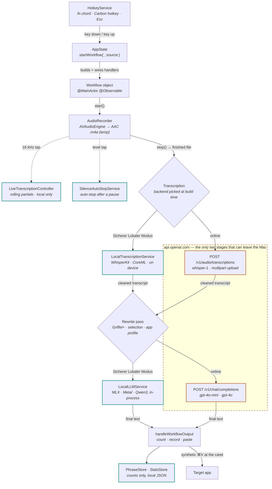
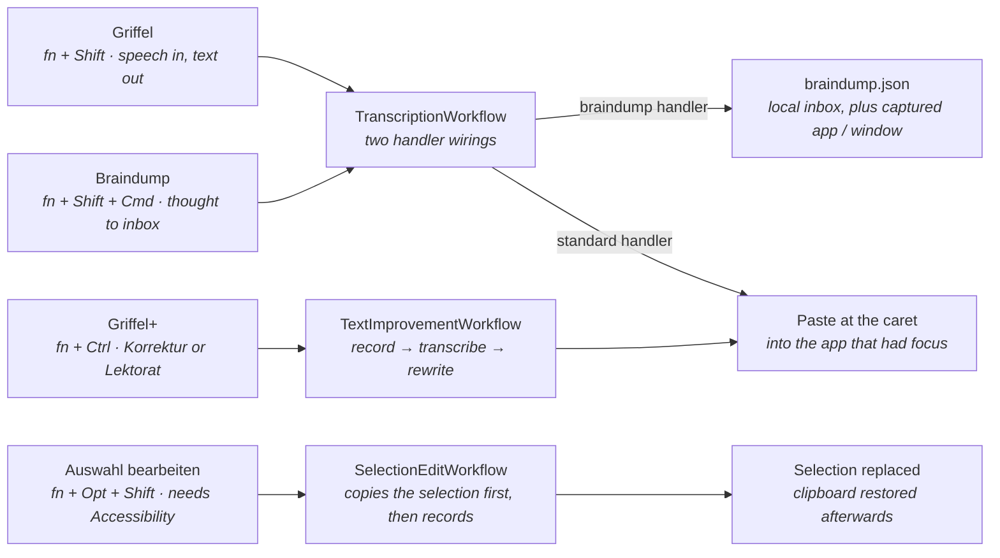
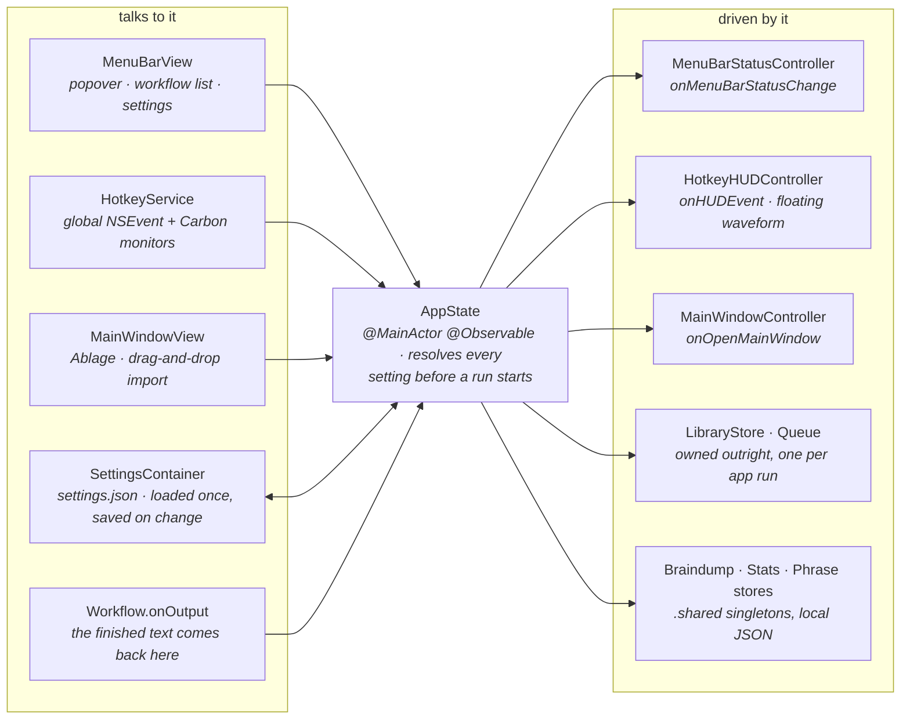
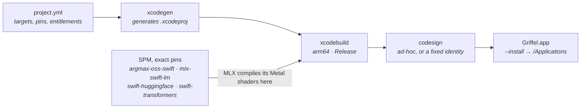

# Architecture

Griffel lives in the menu bar. It records from the microphone, turns the recording into text, optionally rewrites that text, and pastes the result into whatever app you were in. Everything else in the repo — the Ablage (library), the glossary, the stats — hangs off that one round trip.

One setting decides the shape of every run: **Sicherer Lokaler Modus**. Off, transcription and rewriting go to OpenAI. On, transcription runs through WhisperKit/CoreML and rewriting through MLX/Metal, both in-process, and nothing leaves the machine. That switch is not a preference tucked into a settings pane — it is the fork the whole pipeline is built around.

The numbers and names in this document were measured at v1.5.1 (70 Swift files, 15,806 lines). The diagrams describe the code, not a plan — where they drift, the code wins.

## One run, end to end

A hotkey press lands in `AppState.startWorkflow`, which builds a workflow object with every setting already resolved — glossary terms, language code, transcription backend, LLM backend, format profile. The workflow itself never reads settings; it only owns a recorder and a chain of calls.



The same spine runs every workflow. Only the two model stages can cross to OpenAI — teal boxes never leave the Mac, and in Sicherer Lokaler Modus both forks swing to the teal side, so the dashed boundary is never crossed at all.

### What happens between the boxes

The recorder writes AAC to a temp file and hands out two live taps from the same audio buffer: 16 kHz float samples for the rolling partial transcript, and a level signal for silence auto-stop. Both are optional and neither touches the result — the final text always comes from the batch pass over the finished file, which is deleted in a `defer` as soon as transcription returns.

Two gates sit around transcription. `TranscriptionQualityService` rejects a recording that is too short to be speech before any request goes out, and rejects a suspiciously short result afterward, so the pipeline fails with "Keine Aufnahme erkannt." instead of pasting a Whisper hallucination. Filler-word removal and, if an app profile is set, one more LLM formatting pass run after that.

## Four modes, three classes, three endings

The menu bar shows four workflows, but only three classes implement them. Griffel and Braindump are the same class recorded the same way — what separates them is which handler `AppState` wires to `onOutput`.



Griffel and Braindump run the identical recording and transcription path. `configureBraindumpHandlers` swaps the ending: no paste, an inbox entry with the app and window title it was spoken in. Selection edit is the only workflow that reads from the outside world before it records.

## AppState is the switchboard

One 1,438-line `@Observable` class holds the settings, owns the library, and hands everything else its callbacks. The views read it, the controllers are driven by it, and the workflows report back into it. Nothing else knows about anything else.



The controllers never reach into each other; they receive closures. That is why the HUD, the menu-bar icon and the window can all show the same run without knowing it exists — and why `AppState` is the file that grows.

| Directory | Files | Lines | Holds |
|---|---:|---:|---|
| `GriffelMac/App` | 5 | 2,241 | Lifecycle, AppState, status item, HUD and window controllers |
| `GriffelMac/Features` | 21 | 6,846 | Workflows, menu bar, main window, library, braindump, settings, stats |
| `GriffelMac/Services` | 32 | 5,041 | Recording, model calls, storage, hotkeys, permissions, migration |
| `GriffelMac/Views` | 12 | 1,678 | Shared SwiftUI pieces and the glass design system |

## Where the bytes land

Two roots and a keychain entry. Settings and models sit in Application Support; recordings and transcripts sit wherever the user pointed the Ablage, defaulting to a subfolder of the same place — deliberately outside Documents, so iCloud Drive never starts syncing audio behind a privacy promise.

```text
~/Library/Application Support/Griffel/
  settings.json          one JSON file, rewritten on every change
  stats.json             words, sessions, estimated time saved
  braindump.json         the inbox, plus captured app / window title
  phrases.json           aggregated 2–4-word counts, never full text
  models/whisperkit/     CoreML transcription model, downloaded in-app
  models/mlx/            Hugging Face cache layout: models--org--repo
  Aufnahmen/             default Ablage root (relocatable)

<Ablage root>/
  .vc-bibliothek.json    marker only — not an index
  Ideen/                 a topic folder is a real folder
    2026-08-30-onboarding.md    transcript + front matter
    2026-08-30-onboarding.m4a   audio beside it

macOS Keychain
  app.griffel.credentials  OpenAI API key
```

There is no library database. `LibraryFileStore.scan` walks the folder on every refresh and rebuilds state from the files themselves; each `.md` carries its own header — `id`, `title`, `tags`, `engine`, `captured-app` and friends — parsed by a fixed six-rule grammar rather than a YAML dependency, preserving unknown keys so a newer build's fields survive a round trip through an older one. Move a folder in Finder and nothing breaks, because nothing was pointing at it.

## From project.yml to a signed app



`build.sh` checks for the Metal toolchain before anything else, because without it the build dies deep inside the MLX targets where the one useful line is buried. An ad-hoc signature has no stable identity, so every rebuild looks like a new app to macOS and re-asks for Microphone and Accessibility — set `GRIFFEL_CODESIGN_IDENTITY` to stop that (see the [README](../README.md#a-stable-signing-identity)).

## The 32 services, by what they touch

| Concern | Files |
|---|---|
| Capture | `AudioRecorder` · `AudioInputDeviceService` · `LiveTranscriptionController` · `SilenceAutoStopService` · `SelectionCaptureService` · `CaptureContextService` |
| Models | `TranscriptionService` · `LocalTranscriptionService` · `LLMService` · `LocalLLMService` · `TextGenerationService` · `PromptDefaults` |
| Text | `TranscriptionQualityService` · `FillerWordService` · `FormatProfileService` · `GlossaryStore` · `PhraseDetectionService` · `PhraseStore` |
| Storage | `AppSupportPaths` · `LibraryFileStore` · `LibraryModel` · `TranscriptSidecar` · `StatsStore` · `KeychainService` · `AudioImportService` |
| System | `HotkeyService` · `HotkeyBinding` · `AccessibilityPermissionService` · `LaunchAtLoginService` · `InstallLocationService` · `AppCleanupService` · `LegacyMigrationService` |

## If you are changing one thing, start here

| You want to change | Start at |
|---|---|
| A new workflow | Add a case to `WorkflowType`, a default chord in `Hotkey.default(for:)`, a branch in `AppState.startWorkflow`, and a class conforming to `Workflow` — three properties and `start / stop / reset`. |
| Another model provider | Add a case to `LLMBackend` and one branch in `TextGenerationService.run`. Prompts and routing live there; `LLMService` is OpenAI transport only. |
| The prompts | `PromptDefaults` holds the shipped text; an empty stored prompt means "follow the default" rather than a frozen copy of it. |
| Anything on disk | Every path comes from `AppSupportPaths`. The transcript header grammar lives in `TranscriptSidecar` and the folder walk in `LibraryFileStore`. |
| Hotkey behaviour | `HotkeyService` runs two mechanisms at once: NSEvent monitors for modifier chords, `RegisterEventHotKey` for real key combinations so the keystroke is swallowed instead of typed. |
| The privacy promise | Grep for `secureLocalModeEnabled`. Every remote call is downstream of a backend that `AppState` resolved from that flag — nothing calls OpenAI on its own. |
